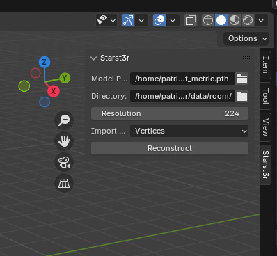
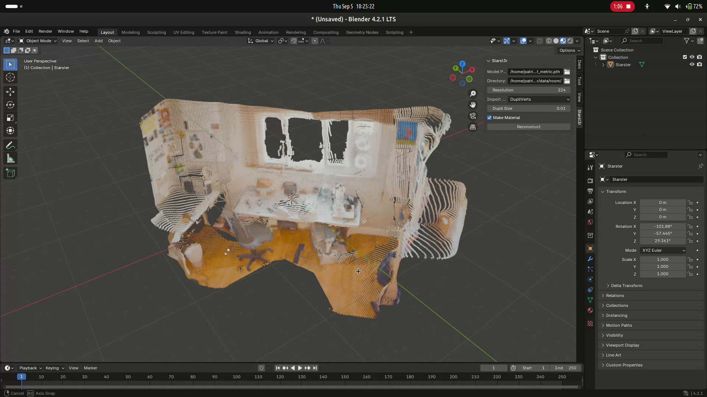
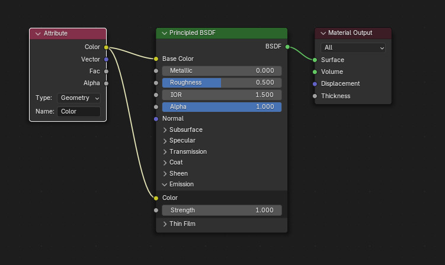

Blender add-on
==============

The Starst3r Blender add-on allows you to use Starst3r directly from the Blender
interface.

.. warning::

   The Blender add-on is still in development.
   Features and quality will improve over time.

   Please SAVE YOUR WORK before using. The reconstruction process will freeze
   Blender for a while.

See :ref:`Blender installation` for installation instructions.

Reconstruction
--------------

.. note::

   Reconstruction takes a while --- up to a few minutes on a small computer.
   Make sure to save your work before starting the reconstruction, and be
   patient while it runs.

   If you want to see ongoing progress, open a terminal.

Reconstruct a scene from images and import a point cloud.

Select the images directory, model weights file, and image resolution.

Select the import mode.

- Vertices: Unconnected point cloud, one vertex per point. Vertex colors are
  added, but Blender cannot render them on degenerate vertices.
- DupliVerts: Add a small tetrahedron on each vertex to display vertex colors.
- Point Cloud: Add a Point Cloud object. TODO: Not implemented yet. Point Cloud
  object is currently a Blender experimental feature.

To use vertex colors in the shader, you can use the Attribute node:

