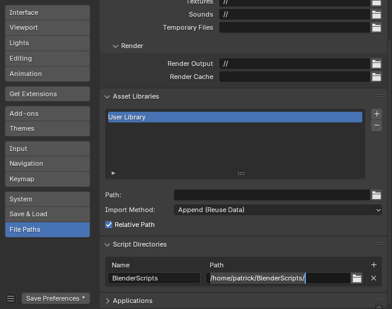

Installation
============

Starst3r Python
---------------

Starst3r can be installed as a pip package.

.. code-block:: bash

   pip install starst3r

The package includes four Python modules:

- ``starster``: The main library.
- ``mast3r``: The Mast3r codebase.
- ``dust3r``: The Dust3r codebase.
- ``models``: Croco v2 codebase.

For most cases, your script will only use the ``starster`` module.

See :ref:`Quickstart` for more information on how to use the library.

Download Mast3r model
---------------------

Download the pretrained Mast3r model.

https://github.com/naver/mast3r/?tab=readme-ov-file#checkpoints

Starst3r uses the same Mast3r model internally.

Building
--------

The Python module can be built and installed from source.

.. code-block:: bash

   ./build.sh python
   pip install build/dist/*.whl

This will create the appropriate file structure and build the Python package in
``build/dist``.

Blender installation
--------------------

Starst3r can be used as a Blender add-on.

Due to the nature of Blender Python, the installation procedure is complicated.

**Please follow the instructions carefully.**

1. Configure scripts
^^^^^^^^^^^^^^^^^^^^

If you haven't done so in the past, you must configure the Blender Python
scripts directory.

This is an additional directory that Blender will load user installed Python
modules from.

Create a new directory where you would like. **Create an extra directory
``modules`` inside your chosen directory.**

So, if you choose to use ``/home/user/BlenderScripts``, you should create a directory
``/home/user/BlenderScripts/modules``.

In Blender's preferences, add a script path and set it to your chosen directory,
**without the ``modules`` directory**.

2. Install modules
^^^^^^^^^^^^^^^^^^

Next, install Starst3r (and it's dependencies) into the ``modules`` directory.

Use the ``--target`` option of pip to set the install dir.

.. code-block::

   pip install --target=/home/user/BlenderScripts/modules starst3r

3. Remove numpy
^^^^^^^^^^^^^^^

There is a known issue with user installed numpy.

Remove the numpy installation from ``modules``.

.. code-block::

   rm -r /home/user/BlenderScripts/modules/numpy*

4. Install add-on
^^^^^^^^^^^^^^^^^

Install the add-on zip file as you would any other add-on.
